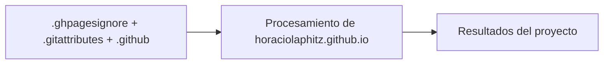

# Portfolio - Horacio Laphitz

## Descripción

Portfolio profesional Analisis de Datos.

## 👋 Sobre mí

Soy **Horacio Laphitz**, Analista de Datos de la cuidad de Posadas, orientado a mejorar procesos con el uso de Machine Learning. Analizo datos y modelos evaluados con métricas.

### URL del Sitio

🌐 **https://horaciolaphitz.vercel.app**

## 📦 Tecnologías

- **Framework**: Astro 5.x
- **UI**: React 18 + Tailwind CSS
- **Lenguaje**: TypeScript
- **Build**: Vite
- **Deploy**: Vercel

## 🏗️ Arquitectura

```
src/
├── domain/          # Lógica de negocio
├── application/     # Casos de uso
├── infrastructure/  # Implementaciones
├── presentation/    # UI Components
└── main/           # DI Container
```

© 2026 Horacio Laphitz.

## Diagrama

[Explorar la arquitectura interactiva en GitDiagram](https://gitdiagram.com/HoracioLaphitz/horaciolaphitz.github.io)



## Tecnologías

- Tecnologías por documentar tras revisar el código fuente.
